==========
User Guide
==========

------------
Introduction
------------

This user guide covers the FIWARE CKAN extensions for the FIWARE release 6. For details on
the usage of CKAN itself please refer to the `CKAN User Guide <http://docs.ckan.org/en/latest/user-guide.html>`__

Any feedback on this document is highly welcomed, including bugs, typos or things you think should be included but aren't.
Please send them to the "Contact Person" email that appears in the `Catalogue page for this GEi`_. Or create an issue at `GitHub Issues`_

.. _Catalogue page for this GEi: https://catalogue.fiware.org/enablers/ckan
.. _GitHub Issues: https://github.com/conwetlab/FIWARE-CKAN-Extensions/issues/new

------
OAuth2
------

When the OAuth2 extension is installed and active in a CKAN instance, all user and sign in features are delegated to
the external IDM. In this regard, the sign in process starts normally by clicking on *sign in*

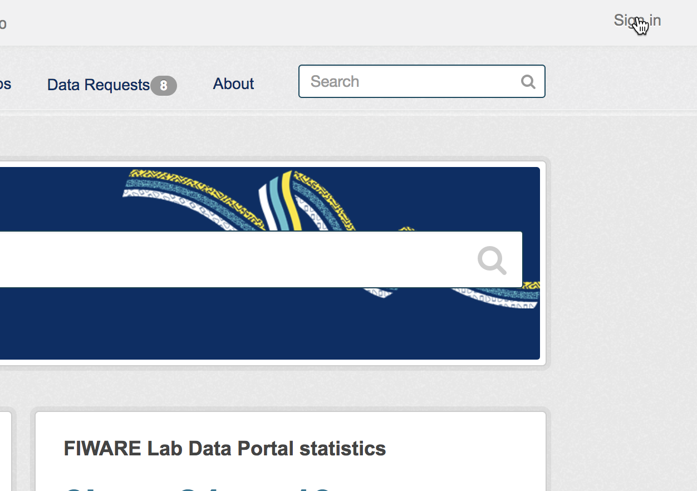

Then, the OAuth2 plugin redirects CKAN to the configured OAuth2 IDM in order to provide user credentials

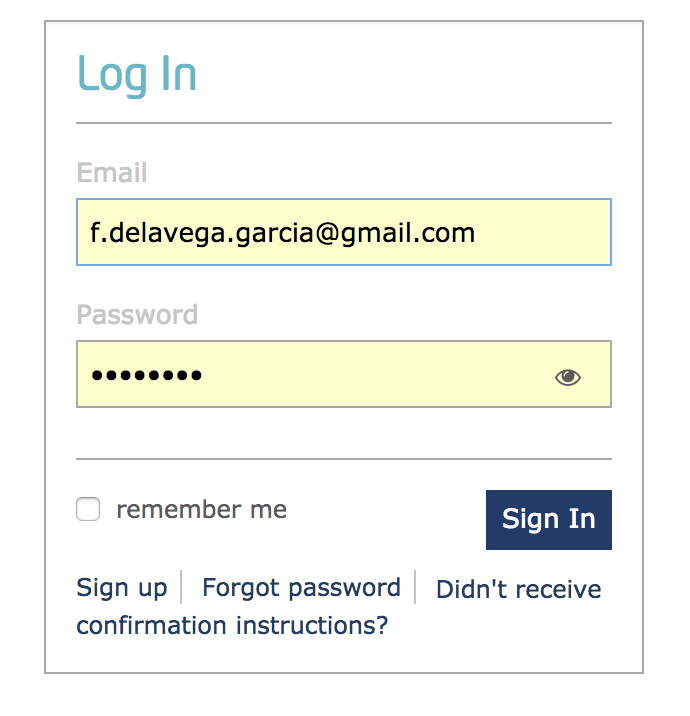

Once done, the browser is redirected back to CKAN with the user signed in

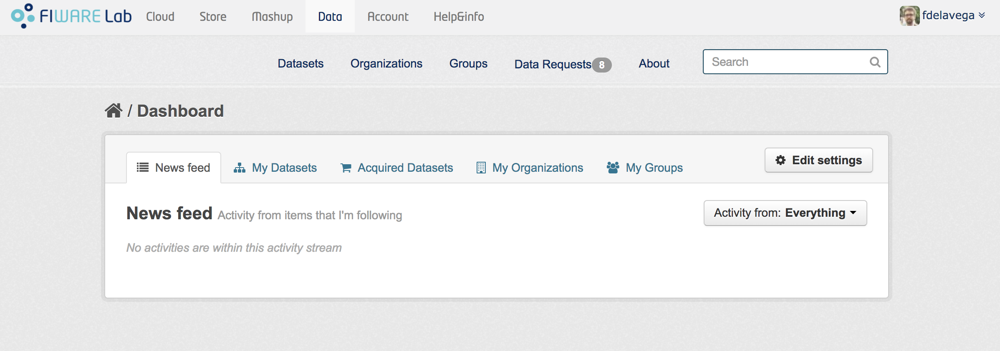

----------------
Private Datasets
----------------

The Private Datasets extension enhance the default dataset access control in CKAN by allowing dataset owners to specify
what users of the platform can access to the data, even if they are not part of the same organization.

Additionally, it establishes the basic mechanism for acquiring access to the data by allowing to discover private datasets
and configuring the site where this access can be acquired.

All these options can be configured in the dataset creation form, so the first step is clicking on *Add Dataset*

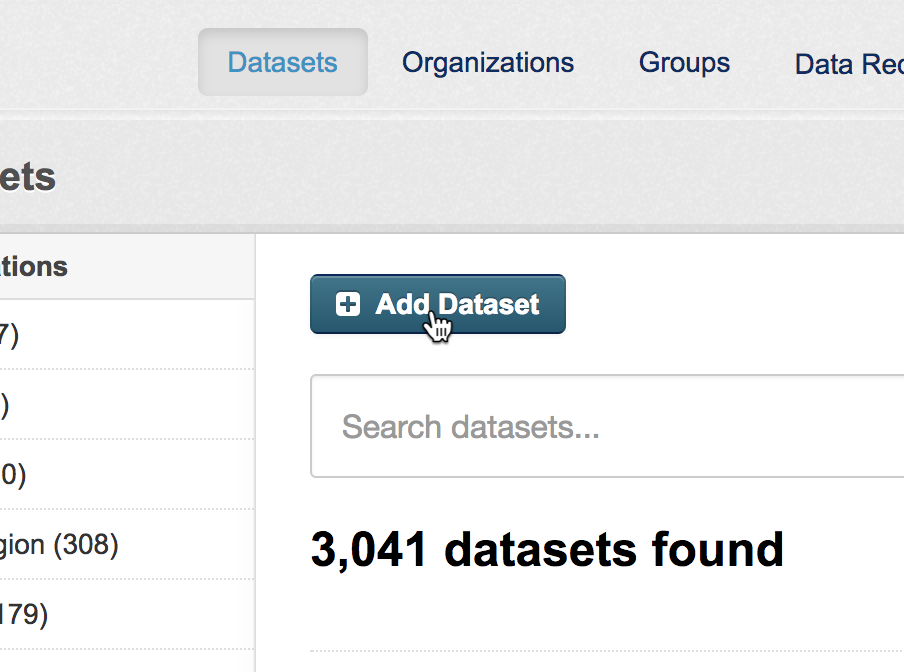

In this form, the extension integrates a set of fields to be filled by the dataset owner

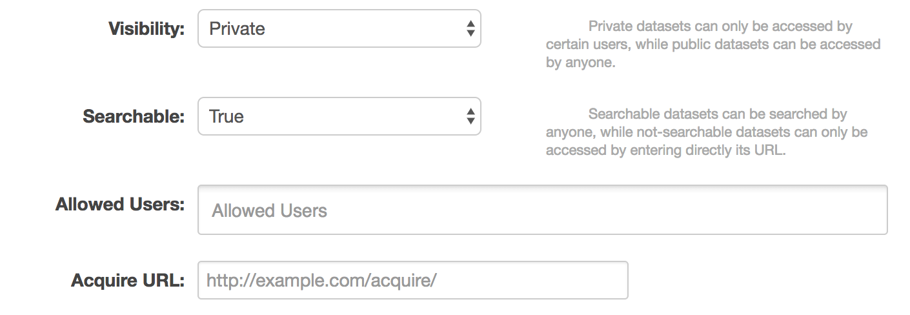

In particular:

* **Visibility**: Public or Private
* **Searchable**: True or false, whether a dataset set as private can be discovered by users, that is, it appears in searches
* **Allowed Users**: List of platform users authorized to access to the data when the dataset has been set as private
* **Acquire URL**: URL where it is possible to acquire access grants to the data

Depending of the chosen configuration and access rights of the users, datasets will appear in a different way. A private dataset
created by the user logged in will appear as:

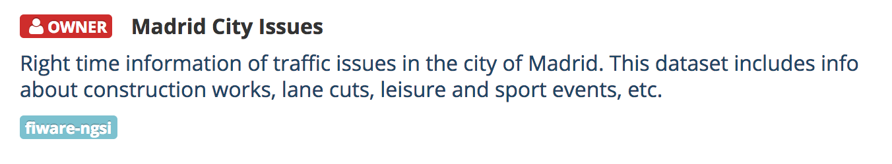

While a private dataset set as searchable will be seen as follows by an user without permissions.

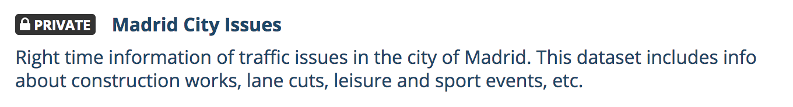

If the dataset also has an *Acquire URL*, a button to access to the site will appear

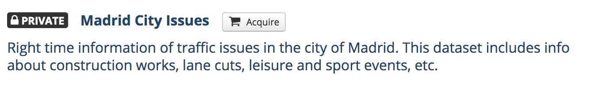

Finally, private datasets will be seen as follows for those users who has access permissions

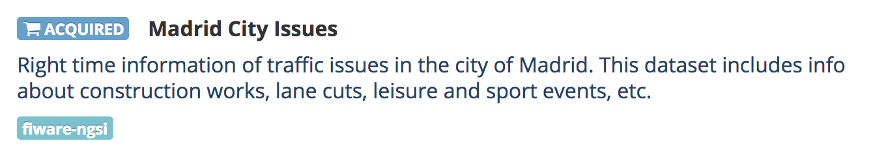

These *acquired* datasets are also located in the user dashboard under the *Acquired Datasets* tab

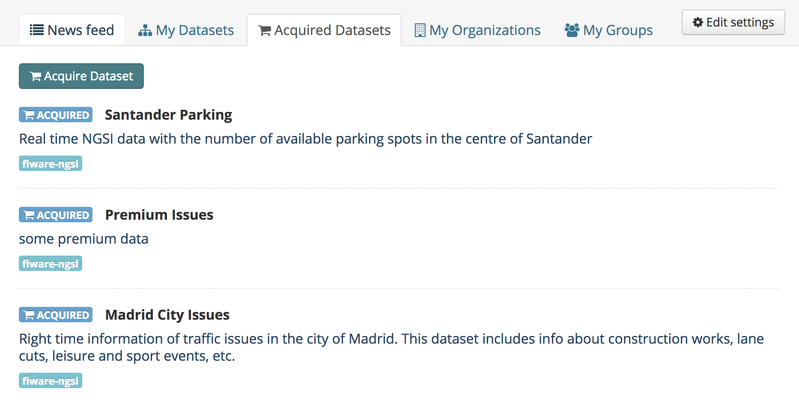

---------
NGSI View
---------

The NGSI View extension enables the publication of right-time context information as dataset resources by allowing to
configure a NGSIv2 query.

This queries are provided as dataset resources, so the extension modifies the dataset resource form

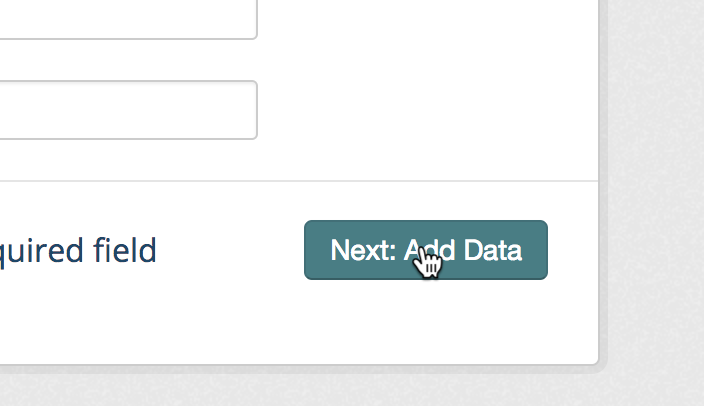

Once creating the dataset resource, it is needed to use *fiware-ngsi* as data type in order to publish the query

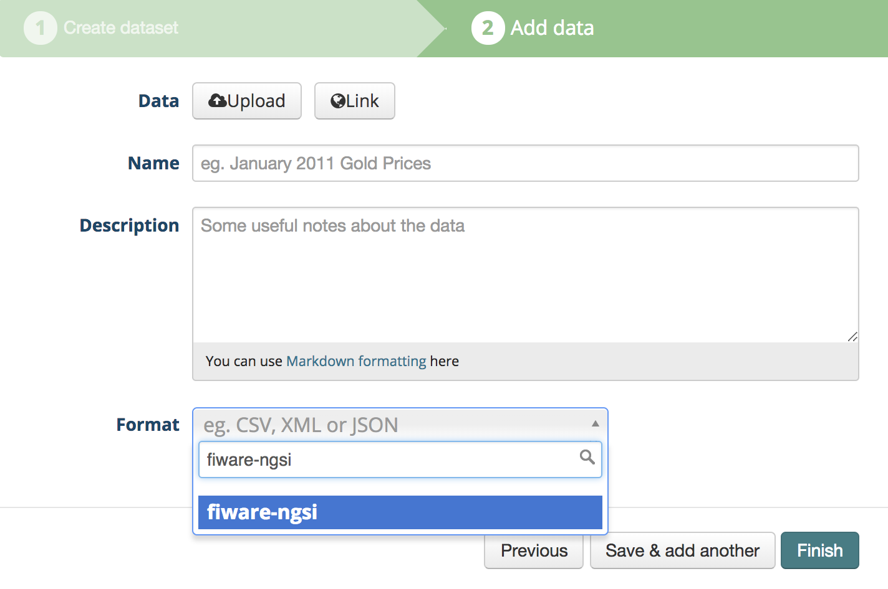

It can be seen that once the *fiware-ngsi* data type is selected, the extension updates the form limiting the data providing
mechanism to *URL* and injects a set of Context Broker specific fields

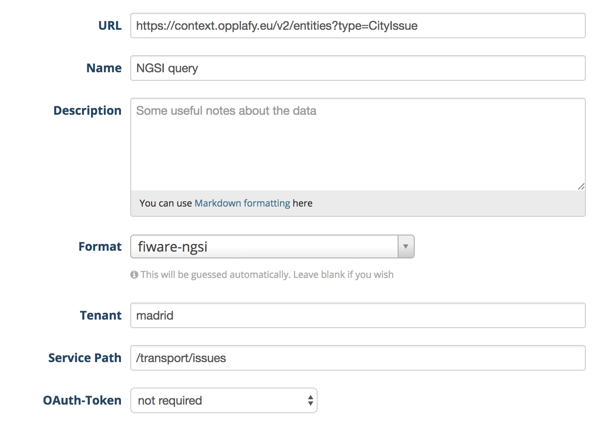

These fields are:

* **URL**: Must include the query URL using NGSIv2
* **Tenant**: Corresponds to the *Fiware-Service* header used by the Context Broker
* **Service Path**: Corresponds to the *Fiware-ServicePath* header used by the Context Broker
* **Auth Required**: Whether to inject the OAuth2 access token of the logged user in the request, that is, the Context Broker is secured

Once the resource has been configured, the resource page includes the executed query and the result in JSON

.. image:: images/ngsi4.png
   :align: center
   :scale: 50%

-------------
BAE Publisher
-------------

--------------
WireCloud View
--------------

-------------
Data Requests
-------------
