==========
User Guide
==========

------------
Introduction
------------

This user guide covers the FIWARE CKAN extensions for the FIWARE release 6. For details on
the usage of CKAN itself please refer to the `CKAN User Guide <http://docs.ckan.org/en/latest/user-guide.html>`__

Any feedback on this document is highly welcomed, including bugs, typos or things you think should be included but aren't.
Please send them to the "Contact Person" email that appears in the `Catalogue page for this GEi`_. Or create an issue at `GitHub Issues`_

.. _Catalogue page for this GEi: https://catalogue.fiware.org/enablers/ckan
.. _GitHub Issues: https://github.com/conwetlab/FIWARE-CKAN-Extensions/issues/new

------
OAuth2
------

When the OAuth2 extension is installed and active in a CKAN instance, all user and sign in features are delegated to
the external IDM. In this regard, the sign in process starts normally by clicking on *sign in*

.. image:: images/oauth1.png
   :align: center
   :scale: 50%

Then, the OAuth2 plugin redirects CKAN to the configured OAuth2 IDM in order to provide user credentials

.. image:: images/oauth2.png
   :align: center
   :scale: 50%

Once done, the browser is redirected back to CKAN with the user signed in

.. image:: images/oauth3.png
   :align: center

----------------
Private Datasets
----------------

The Private Datasets extension enhance the default dataset access control in CKAN by allowing dataset owners to specify
what users of the platform can access to the data, even if they are not part of the same organization.

Additionally, it establishes the basic mechanism for acquiring access to the data by allowing to discover private datasets
and configuring the site where this access can be acquired.

All these options can be configured in the dataset creation form, so the first step is clicking on *Add Dataset*

.. image:: images/private1.png
   :align: center
   :scale: 50%

In this form, the extension integrates a set of fields to be filled by the dataset owner

.. image:: images/private2.png
   :align: center
   :scale: 50%

In particular:

* **Visibility**: Public or Private
* **Searchable**: True or false, whether a dataset set as private can be discovered by users, that is, it appears in searches
* **Allowed Users**: List of platform users authorized to access to the data when the dataset has been set as private
* **Acquire URL**: URL where it is possible to acquire access grants to the data

Depending of the chosen configuration and access rights of the users, datasets will appear in a different way. A private dataset
created by the user logged in will appear as:

.. image:: images/private3.png
   :align: center
   :scale: 50%

While a private dataset set as searchable will be seen as follows by an user without permissions.

.. image:: images/private4.png
   :align: center
   :scale: 50%

If the dataset also has an *Acquire URL*, a button to access to the site will appear

.. image:: images/private5.png
   :align: center
   :scale: 50%

Finally, private datasets will be seen as follows for those users who has access permissions

.. image:: images/private6.png
   :align: center
   :scale: 50%

These *acquired* datasets are also located in the user dashboard under the *Acquired Datasets* tab

.. image:: images/private7.png
   :align: center
   :scale: 50%

---------
NGSI View
---------

The NGSI View extension enables the publication of right-time context information as dataset resources by allowing to
configure a NGSIv2 query.

This queries are provided as dataset resources, so the extension modifies the dataset resource form

.. image:: images/ngsi1.png
   :align: center
   :scale: 50%

Once creating the dataset resource, it is needed to use *fiware-ngsi* as data type in order to publish the query

.. image:: images/ngsi2.png
   :align: center
   :scale: 50%

It can be seen that once the *fiware-ngsi* data type is selected, the extension updates the form limiting the data providing
mechanism to *URL* and injects a set of Context Broker specific fields

.. image:: images/ngsi3.png
   :align: center
   :scale: 50%

These fields are:

* **URL**: Must include the query URL using NGSIv2
* **Tenant**: Corresponds to the *Fiware-Service* header used by the Context Broker
* **Service Path**: Corresponds to the *Fiware-ServicePath* header used by the Context Broker
* **Auth Required**: Whether to inject the OAuth2 access token of the logged user in the request, that is, the Context Broker is secured

Once the resource has been configured, the resource page includes the executed query and the result in JSON

.. image:: images/ngsi4.png
   :align: center
   :scale: 50%

-------------
BAE Publisher
-------------

The BAE Publisher extension integrates CKAN with an instance of the Business API Ecosystem GE by providing a form that
can be filled in order to create products and offerings of private datasets directly from the CKAN interface.

This extension automatically fills the *Acquire URL* field of the dataset, so it delegates in the Private Dataset extension
the access control management in the CKAN portal.

To publish a private dataset as an offering in the BAE, the first step is accessing to its *Management* section.

.. image:: images/bae1.png
   :align: center
   :scale: 50%

The publication form is located under the *Publish* tab

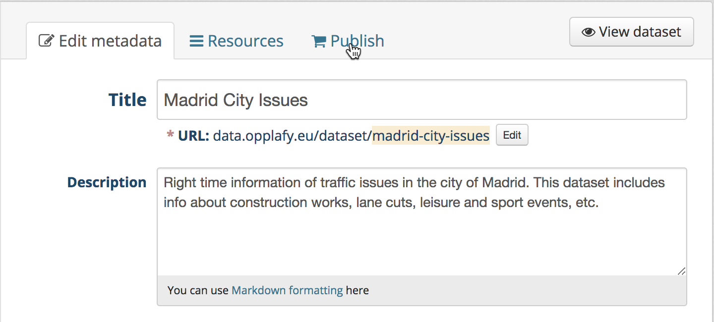

The extension accesses the BAE API in order to retrieve some basic information (Available categories and user catalogs) and
presents a single form that can be used in order to create a product and a basic offering in the BAE

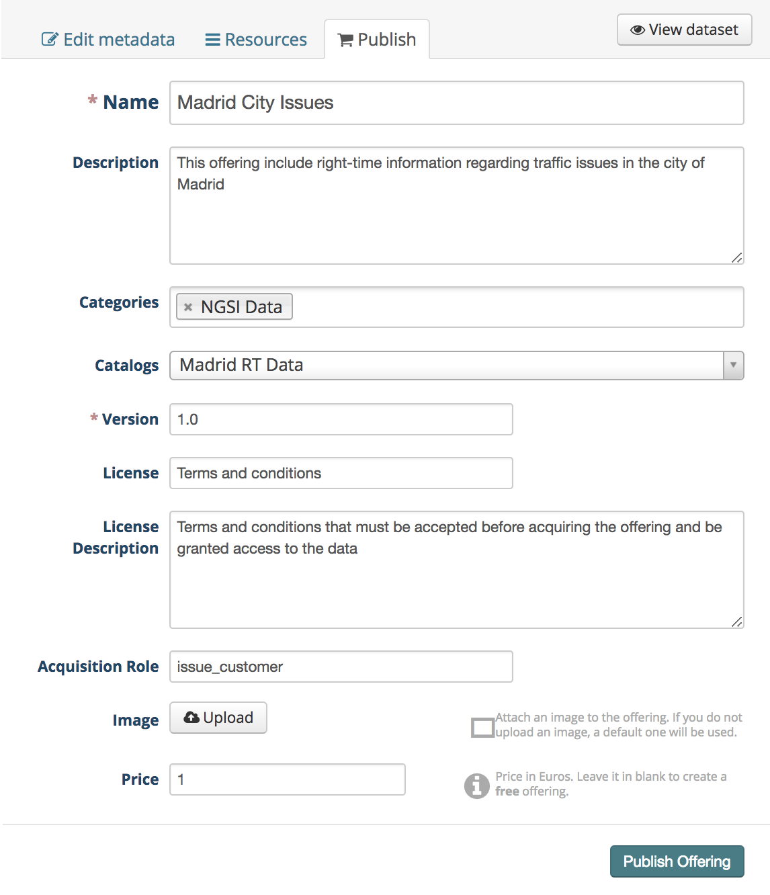

The fields to fill are:

* **Name**: Name of the offering to be created in the BAE
* **Description**: Description of the offering to be created in the BAE
* **Categories**: List of categories for the offering to be created. The available list of categories is retrieved from the BAE
* **Catalog**: Catalog where publishing the offering to be created. The list of available user catalogs are retrieved from the BAE
* **Version**: Version of the offering to be created in the BAE
* **License**: Header of the terms and conditions to be accepted by customers
* **License Description**: Text of the terms and conditions to be accepted by customers
* **Acquisition Role**: If the dataset includes a secured backend service (e.g a Context Broker), role to be granted to the customers so they can access directly to the data service
* **Image**: Image to be displayed with the offering, by default the CKAN logo
* **Price**: Price of the offering or none if the offering is free. For the creation of more complex price models the BAE interface should be used, see the `BAE user guide <http://business-api-ecosystem.readthedocs.io/en/latest/user-programmer-guide.html>`__ for details on this topic

--------------
WireCloud View
--------------

The WireCloud View extension allows to embed a WireCloud dashboard in CKAN as a dataset resource view. This way its is
possible to create rich and customizable data visualizations (including right-time NGSI) without the need of installing
new specific CKAN view extensions or restarting the CKAN instance.

The first step for embedding a WireCloud Dashboard is accessing the Management section of the particular data resource.

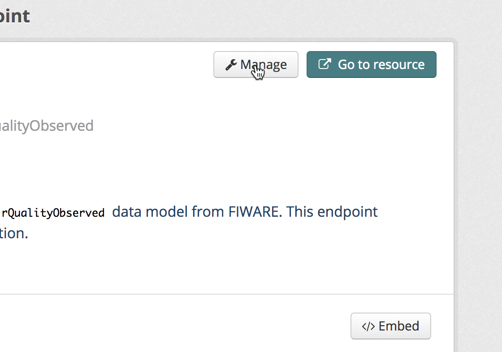

And accessing to the *Views* tab

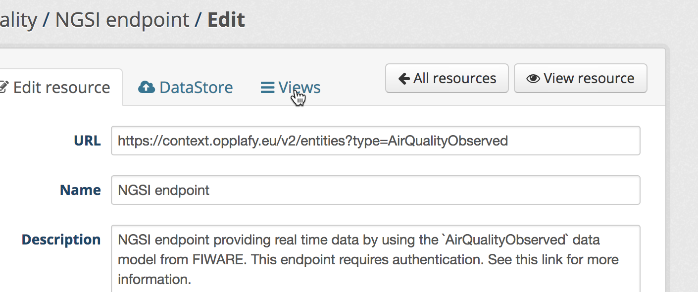

The WireCloud view is one of the allowed ones.

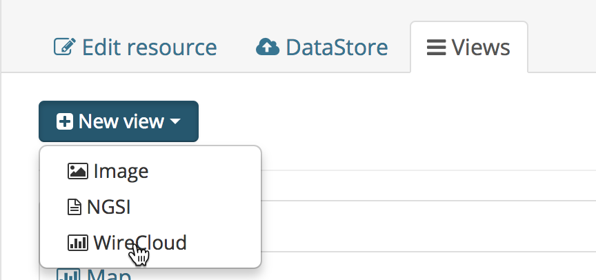

For creating the view, it is needed to provide a name and a description. Then, the user can select one of the available
visualization dashboards.

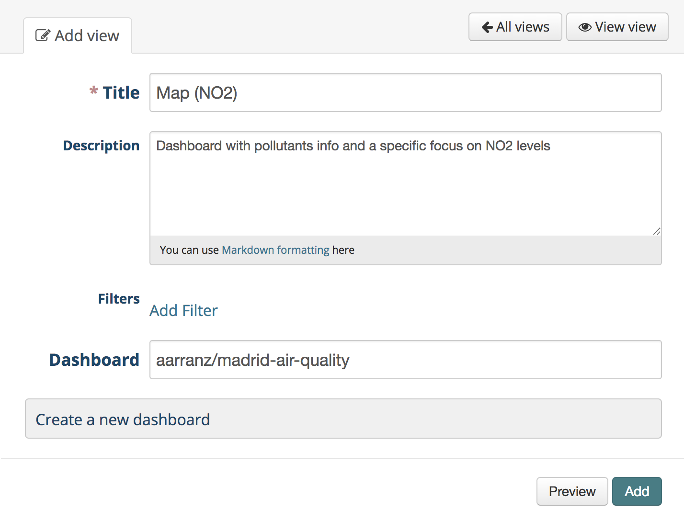

Once created, the dashboard is included as a resource visualization.

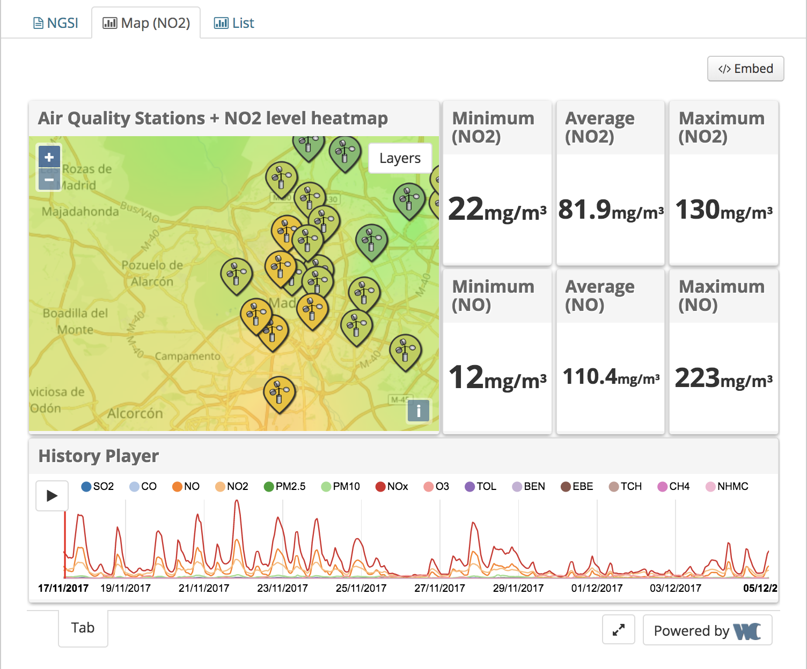

-------------
Data Requests
-------------

The Data Requests extension allows users of the platform to ask for data which is not yet published in the CKAN instance, while
enables admins to manage the lifecycle of that request.

To create a new Data Request, the first step is accessing to the *Data Requests* section included by the extension.

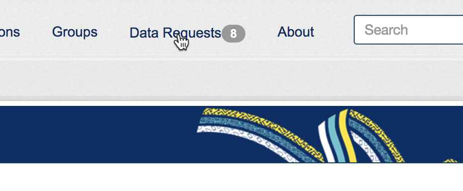

And click on *Add Data Request*.

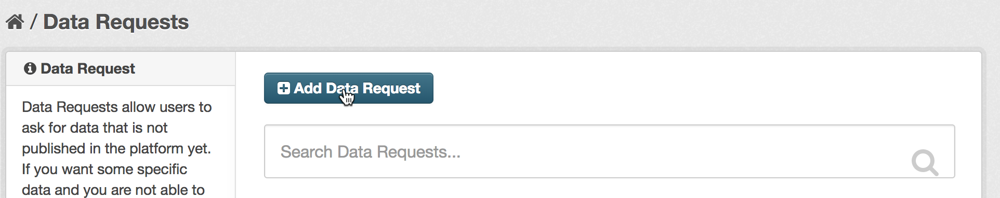

In the displayed form, it is needed to provide a title for the request and a complete description of the requested data.

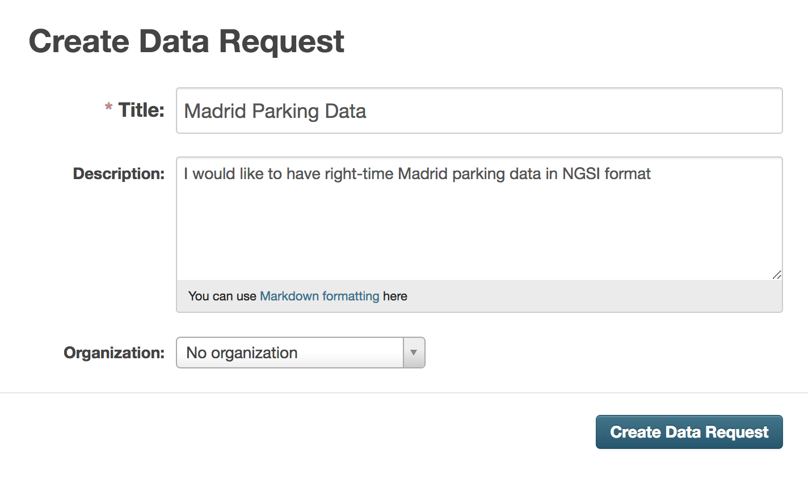

Once created, the new data request appears in the *Data Requests* section, being possible to be searched.

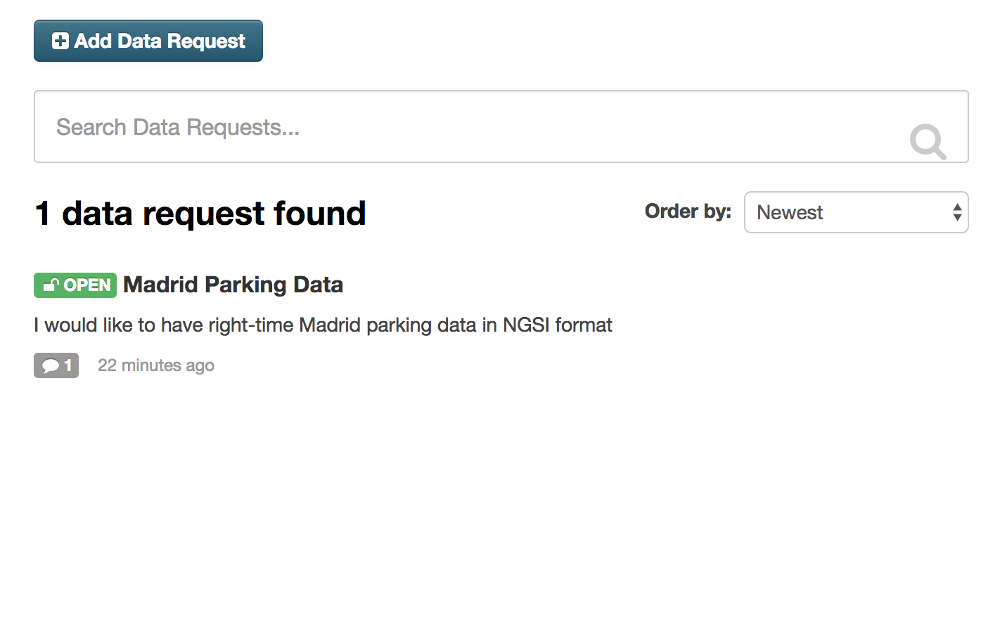

In addition, it is also possible to view the data request details.

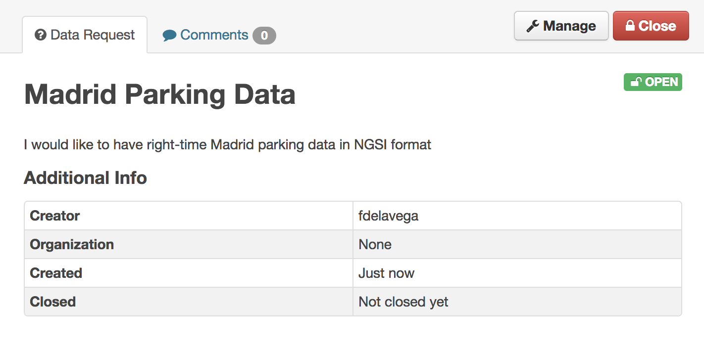

This extension allows the creation of comments, so it enables the communication between data requesters and data providers
in order to make easier the resolution of the request. This option is available in the *Comments* tab of the data request
details page.

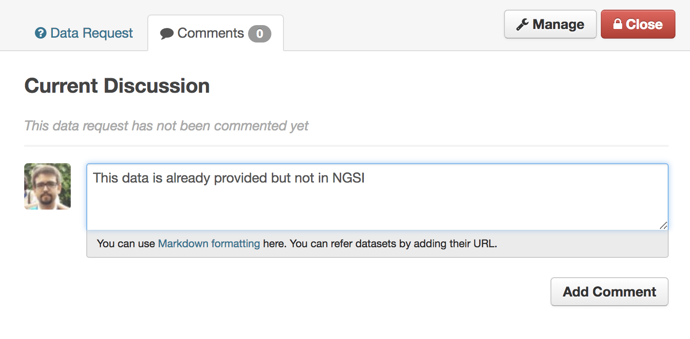

Once the data has been provided or it has been decided that the request cannot be satisfied, it is possible to close the
request by clicking on the *Close* button of the data request details.

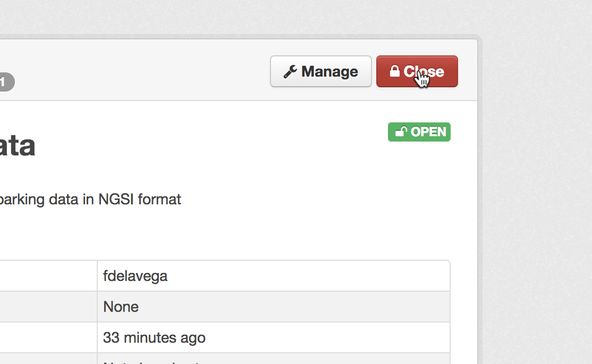

Then, the extension will ask for the dataset which satisfies the request. If the data request is being closed because it cannot
be satisfied, it is possible to leave this value to *No Dataset*

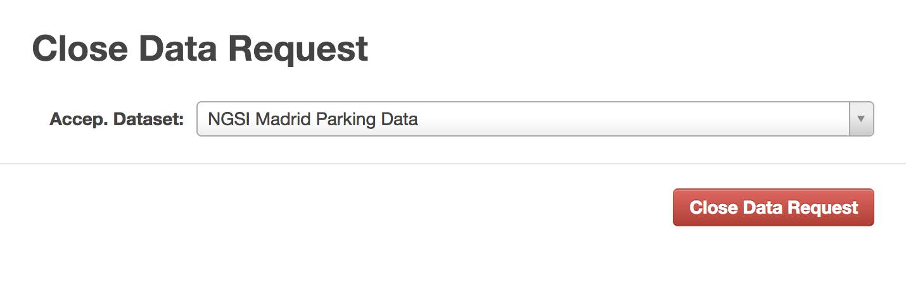

Now, the data request appears are closed in the list.

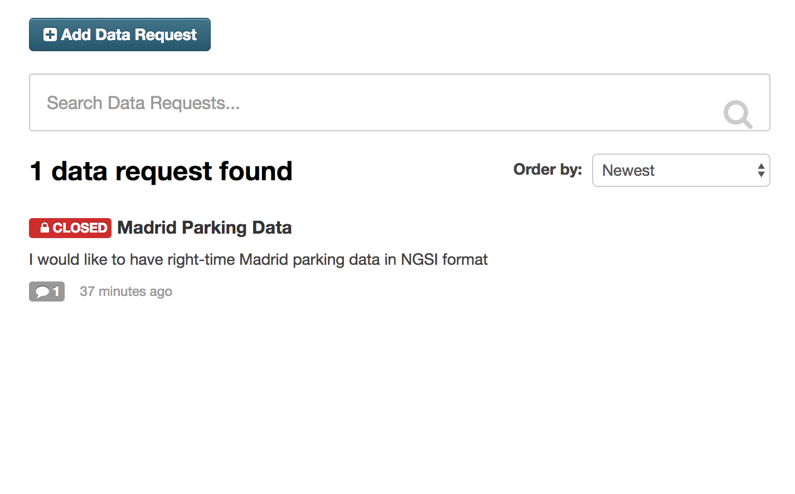

Finally, it is possible to manage requests updating the title or description or deleting it from CKAN.

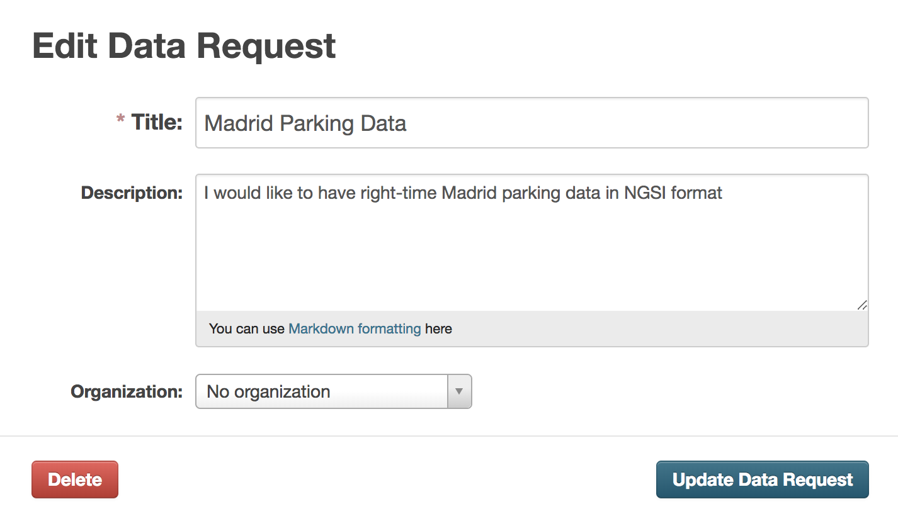
